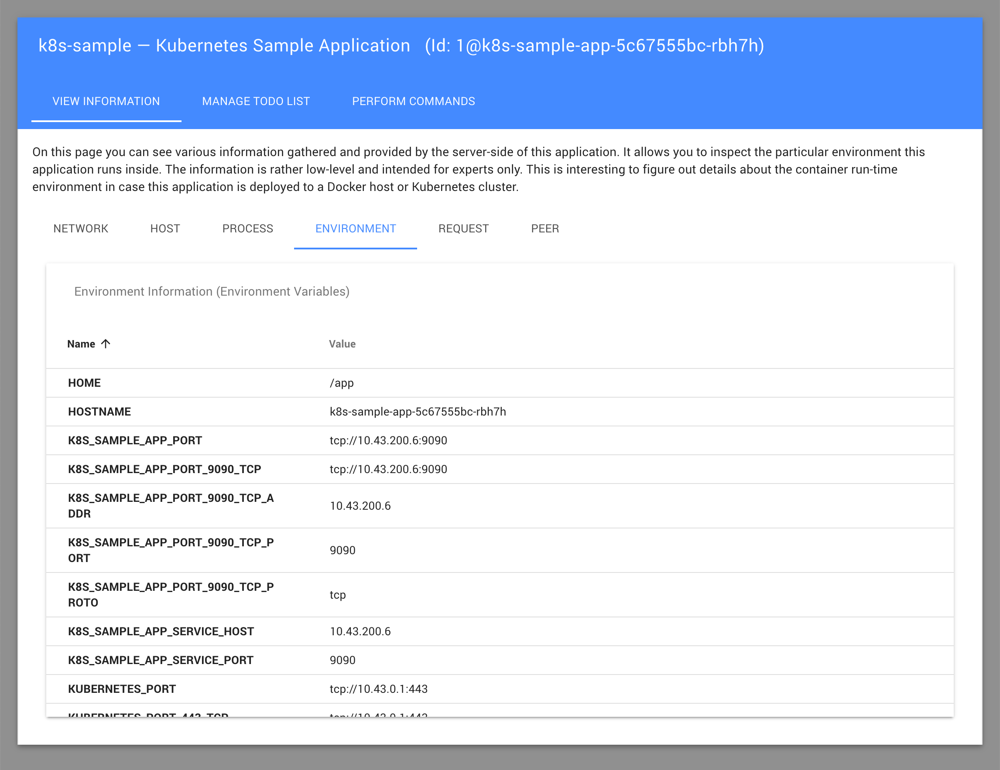

k8s-sample &mdash; Kubernetes Sample Application
================================================

This is a sample application for testing the deployment on the
container run-times Docker and Kubernetes (K8S). The application uses a
Rich-Client architecture, comprised of an HTML5 Single-Page Application
(SPA) client and a Node.js server and runs under an arbitrary URL
prefix. The application shows



Understanding the Parts
-----------------------

The k8s-sample consts of the following parts:

- `0-environment`:<br/>
  Here you can find scripts for establishing your local Docker and/or
  Kubernetes environment. In order to build and deploy *k8s-sample*, the
  CLIs for accessing a Docker and/or Kubernetes run-time environment is
  required. Two Bash scripts help you to provision those CLIs locally
  under Linux (amd64) systems.

  - For standard contexts:

    ```sh
    $ source 0-environment/docker.bash
    $ source 0-environment/kubernetes.bash
    ```

  - For special msg Project Server (PS) contexts:

    ```sh
    $ source 0-environment/docker-ps.bash     <hostname>
    $ source 0-environment/kubernetes-ps.bash <hostname>
    ```

- `1-source`:<br/>
  Here you can find the sources of the *k8s-sample* HTML5 SPA client and
  the corresponding Node.js server. Only used by you in case you want
  to understand the application.

  ```sh
  $ (cd 1-source/fe && make)
  $ (cd 1-source/be && make)
  ```

- `2-image`:<br/>
  Here you can find the procedure for building and packaging the
  *k8s-sample* application as a Docker container. Only used by you in
  case you want to understand the Docker container packaging.

  ```sh
  $ (cd 2-image && make)
  ```

- `3-runtime-docker`:<br/>
  Here you can find the procedure for deploying *k8s-sample* onto
  a Docker run-time environment via docker(1) and docker-compose(1).

  ```sh
  $ (cd 3-runtime-docker && make up logs)
  # access the application via http://<hostname>:9090/
  $ (cd 3-runtime-docker && make down)
  ```

- `4-runtime-kubernetes`:<br/>
  Here you can find the procedure for deploying *k8s-sample* onto
  a Kubernetes run-time environment via kubectl(1) and helm(1).

  ```sh
  $ (cd 4-runtime-kubernetes && make up logs)
  # access the application via http://<hostname>:9090/
  $ (cd 4-runtime-kubernetes && make down)
  ```

